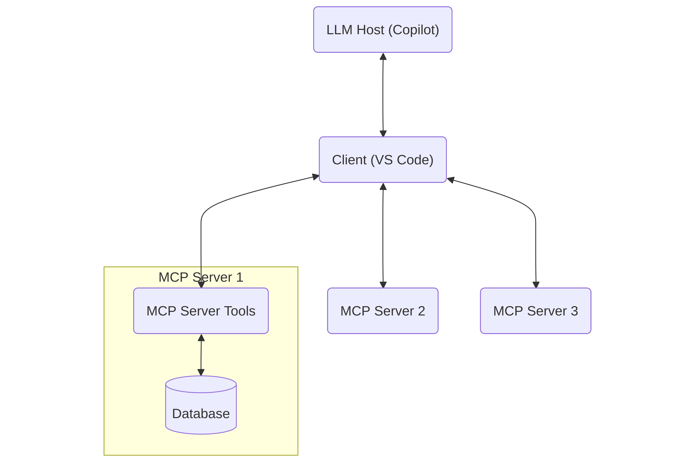

+++
title = "./mcp-example"
date = 2025-11-28T20:15:00+08:00

[taxonomies]
tags = ["rust", "blogging","mcp","llm","tutorial"]
+++

# cargo new mcp-server

I have been learning a bit about [MCP](https://modelcontextprotocol.io/docs/getting-started/intro) and to better understand how the protocol can actually be used, specifically with Rust (and hopefully for Rust - but that's a story for another post!), I started with the [Rust SDK](https://github.com/modelcontextprotocol/rust-sdk). 
<!-- more -->
After looking around I made my way to the examples directory and found a simple example that implements a counter using the `std::io`. 

## mcp --help --more

The MCP documentation and explanation is quite good and from the [MCP Introduction](https://modelcontextprotocol.io/docs/getting-started/intro) I was able to get a better grasp on what was going on with the counter example.

### man MCP 

The basic idea of the Model Context Protocol - MCP, is to create a standard means of giving an LLM (the host) context and tools via the server. The way the host is able to interact with the server is through the client. For my purposes the client is VS Code, and the host is Copilot. 



The example above illustrates how the llm would engage with a database through an MCP server, along with potentially other MCP servers. Note that the important part here is the Client and server. The MCP server will provide the `tools` that the LLM will have access to and can itself invoke (via the server). 

# Rust SDK: cargo run --example 

Looking at the Rust SDK repo, there was an example that caught my eye. I'm not looking for a server that would run remotely, so this one looks like a good place to start:
> [**Counter Standard I/O Server (`counter_stdio.rs`)**](https://github.com/modelcontextprotocol/rust-sdk/tree/main/examples/servers#counter-standard-io-server-counter_stdiors)
>
> A basic MCP server that communicates using standard input/output transport.
>
> - Provides a simple counter tool with increment, decrement, and get_value operations  
> - Demonstrates basic tool implementation and stdio transport

Simple and local! Cracking open the example [`counter_stdio.rs`](https://github.com/modelcontextprotocol/rust-sdk/blob/main/examples/servers/src/counter_stdio.rs), the first thing I notice:
```rust
#[tokio::main]
async fn main() -> Result<()> {
...
}
```
Does it need to be `async` for std `i/o`? I don't think so. Reading and writing to stdin/stdout doesn't require an async runtime. But the MCP protocol itself *is* concurrent, which makes sense for a server right? A server needs to process multiple requests and more without blocking. So it appears the Rust SDK uses `async` because the protocol does. Which does seem to mean we're going to need to write those extra `async` boilerplate bits like `.await` and so on.

Looking around the [`counter.rs`](https://github.com/modelcontextprotocol/rust-sdk/blob/main/examples/servers/src/common/counter.rs) there is a lot going on. The main thing that catches my eye is the `#[tool_router]`. That looks like where the server's `tools` are generated for the **host** to use. Here's the first simple tool they give:
```rust
    #[tool(description = "Increment the counter by 1")]
    async fn increment(&self) -> Result<CallToolResult, McpError> {
        let mut counter = self.counter.lock().await;
        *counter += 1;
        Ok(CallToolResult::success(vec![Content::text(
            counter.to_string(),
        )]))
    }
```
That seems fairly simple to understand. Its using `.await` so we are looking at `async` here too. It looks like this tool is in the `impl` for a struct called `Counter` with a field `counter: Arc<Mutex<i32>>,` and the tool `increment(&self)` counts by one. Then something called `CallToolResult` returns a `vec` containing the count as a `String`. It's not the easiest boilerplate upfront but at least there's an example to follow!

## mcp --help --tools

An MCP server gives access to the **tools** the *host* (LLM) can use. The host accesses these tools via the **client**. In the above example something like Copilot in VS Code should be able to see the tools available for the **counter** server thanks to the SDK's `#[tool_router]` for the `Counter` struct `impl`, and the `#[tool]` macro for the `increment(&self)` method. Notice the description in the macro? 
```rust
#[tool(description = "Increment the counter by 1")]
```
This is viewable for the host when it queries the server using the **MCP**. So it expects to get a list of tools back first, then it can call those tools as needed. 

It looks like for this example we pass a number and then the host will call this `tool` repeatedly until it counts to that number. 

## mcp --help --prompts

In addition to the `tools` for the host, we can also generate **prompts** to send to the host via the client. In VS Code this populates the message input field for Copilot chat. The counter example file has two methods `example_prompt` and `counter_analysis`. How do we know they are prompts? The macros!
```rust
#[prompt(name = "example_prompt")]
```
There is once again a lot of boilerplate here, but the `example_prompt` basically just takes a message we write to the server, then adds `This is an example prompt with our message here: ` before our message and then sends it over to the chat. **NOTE** it *thankfully* doesn't send the message, it just generates it. A prompt seems like it could be useful to generate based on the available tools on the server and maybe some parameters defined by the user, to help generate a succinct message to the host. Then the host can easily use the tools mentioned in the prompt for whatever purpose. 

## mcp --help --handlers
Next there is another `impl` block for `Counter` with two macros:
```rust
#[tool_handler]
#[prompt_handler]
```
This would be where the MCP server can be queried by the host using these methods: 

- `get_info()`: returns the server's basic metadata and capabilities. This is how the host knows what the server can do. In this case the server sends back a `ServerInfo` structure that contains `instructions` where the server's info is defined. 
- `list_resources()`: Lists any resources the server may have. This looks like its not being used for the example.
- `read_resource(..)`: This would read a specific resource, which looks like it could be a file etc. that is then shared with the host. Also not used for this example.
- `list_resource_templates(..)`: I think this is for telling the host the types of resources this server can use. 
- `initialize(..)`: This is where the server and host first meet and the server is initialized. In the example its returning `get_info()` to the host.

The `handler` methods don't need a macro themselves, just the `impl` block. This example really only seems to be using `get_info()` and `initialize(..)`, which makes sense for a server that just counts to a number. 

# cd mcp-server/ 

Now that we have an idea of what a basic example can look like, maybe we can make one that does something simple like list the files recursively in the current directory and generate a prompt for the server that contains them? Let's go!

## cargo add 

We need to add our dependencies. I'll mostly follow the example's dependencies but strip it down a bit more:
```bash
cargo add anyhow 
cargo add rmcp --features transport-io
cargo add serde_json
cargo add tokio --features rt-multi-thread,macros
```
Our `Cargo.toml` should look something like this so we can use the SDK:
```toml
[package]
name = "mcp-server"
version = "0.1.0"
edition = "2024"

[dependencies]
anyhow = "1.0.100"
rmcp = { version = "0.9.1", features = ["transport-io"] }
serde_json = "1.0.145"
tokio = { version = "1.48.0", features = ["rt-multi-thread", "macros"] }
```

## src/main.rs

For the entry point we'll just mostly copy their example, since it appears to just be an entry point but strip out all the logging:
```rust
//! Entry point for the MCP server

mod directory_peek; // src/directory_peek.rs
use directory_peek::DirectoryPeek;

use anyhow::Result;
use rmcp::{ServiceExt, transport::stdio};

#[tokio::main]
async fn main() -> Result<()> {
    // Create an instance of the directory-list router
    let service = DirectoryPeek::new().serve(stdio()).await?;
    service.waiting().await?;
    Ok(())
}
```
I barely changed anything besides removing all the logging tooling.

## directory_peek.rs 

Next we'll make a module for looking at the current working directory content. We could add parameters to specify the directory to look at and the recursive depth allowed, but I think that's moving past the proof of concept. For now let's just grab everything we can find in the current directory. I'm not going to include more than I need to in order to get the job done. 

```rust
use std::{
    env, fs,
    path::{Path, PathBuf},
    sync::Arc,
};
use tokio::sync::Mutex;

use rmcp::{
    ErrorData as McpError, RoleServer, ServerHandler,
    handler::server::{
        router::{prompt::PromptRouter, tool::ToolRouter},
        wrapper::Parameters,
    },
    model::{
        CallToolResult, Content, GetPromptRequestParam, GetPromptResult, Implementation,
        InitializeRequestParam, InitializeResult, JsonObject, ListPromptsResult,
        PaginatedRequestParam, PromptMessage, PromptMessageRole, ProtocolVersion,
        ServerCapabilities, ServerInfo,
    },
    prompt, prompt_handler, prompt_router, serde_json,
    service::RequestContext,
    tool, tool_handler, tool_router,
};

// Recursively collect all files under `dir` (I did mention recursion!)
fn collect_files(dir: &Path, acc: &mut Vec<PathBuf>) {
    if let Ok(entries) = fs::read_dir(dir) {
        for entry in entries.flatten() {
            let path = entry.path();
            if path.is_dir() {
                collect_files(&path, acc);
            } else if path.is_file() {
                acc.push(path);
            }
        }
    }
}

/// Structure for holding the current directory's content
#[derive(Clone)]
pub struct DirectoryPeek {
    files: Arc<Mutex<Vec<PathBuf>>>,
    tool_router: ToolRouter<DirectoryPeek>,
    prompt_router: PromptRouter<DirectoryPeek>,
}

#[tool_router]
impl DirectoryPeek {
    pub fn new() -> Self {
        let mut files = Vec::new();

        if let Ok(cwd) = env::current_dir() {
            collect_files(&cwd, &mut files);
        }

        Self {
            files: Arc::new(Mutex::new(files)),
            tool_router: Self::tool_router(),
            prompt_router: Self::prompt_router(),
        }
    }

    /// List all files under the working directory as newline-separated paths
    #[tool(description = "List all files under the server's working directory")]
    async fn list_files(&self) -> Result<CallToolResult, McpError> {
        let files = self.files.lock().await;
        let listing = files
            .iter()
            .map(|p| p.to_string_lossy())
            .collect::<Vec<_>>()
            .join("\n");

        Ok(CallToolResult::success(vec![Content::text(listing)]))
    }
}

#[prompt_router]
impl DirectoryPeek {
    /// Summarize the directory contents and show a short preview
    #[prompt(name = "directory_summary")]
    async fn directory_summary(
        &self,
        _params: Parameters<JsonObject>,
        _ctx: RequestContext<RoleServer>,
    ) -> Result<Vec<PromptMessage>, McpError> {
        let message = "Take a look at all these files!\n";
        let files = self.files.lock().await;
        let list = files
            .iter()
            .map(|p| format!("- {}", p.to_string_lossy()))
            .collect::<Vec<_>>()
            .join("\n");
        let output = message.to_string() + &list;
        Ok(vec![PromptMessage::new_text(PromptMessageRole::User, output)])
    }
}

#[tool_handler]
#[prompt_handler]
impl ServerHandler for DirectoryPeek {
    fn get_info(&self) -> ServerInfo {
        ServerInfo {
            protocol_version: ProtocolVersion::V_2024_11_05,
            capabilities: ServerCapabilities::builder()
                .enable_tools()
                .enable_prompts()
                .build(),
            server_info: Implementation::from_build_env(),
            instructions: Some("DirectoryPeek exposes a directory-listing tool and a directory summary prompt.".to_string()),
        }
    }

    async fn initialize(
        &self,
        _req: InitializeRequestParam,
        _ctx: RequestContext<RoleServer>,
    ) -> Result<InitializeResult, McpError> {
        Ok(self.get_info())
    }
}
```
This seems like the simplest form of a server we're going to get for this functionality. The `collect_files(dir: &Path, acc: &mut Vec<PathBuf>)` will recursively collect all files. That's probably a bad idea since I'm not ignoring any directories right now (what could possibly go wrong?!). If we wanted to expand the project later we'd probably want to fix that first.

Now we just need to run our server in VS Code to generate our prompt or use our tool. That means we gotta add it to VS Code.

## code mcp-server

I think there are a few ways to add our server to VS Code. It looks like we can manually generate the `.vscode/mcp.json` but I would rather use the command palette's prompts. So on Linux: `Ctrl+Shift+P` and then select `MCP: Add Server...` and then `Command (stdio)` and then `cargo run`. I feel like its a little dirty and it will only work if we stay in the root of our mcp-server project, but its a proof of concept. So lets prove the concept. 

**note:** in my case I did have to tweak the `json` it generated to the full path for my cargo installation, which we can see if we do:
```bash
which cargo
```
in my case its: `/home/alex/.cargo/bin/cargo`. So the fixed `mcp.json` should look something like this:
```json
{
	"servers": {
		"directory-list": {
			"type": "stdio",
			"command": "/home/alex/.cargo/bin/cargo",
			"args": [
				"run"
			]
		}
	},
	"inputs": []
}
```
In VS Code I just called my server `directory-list`. 

### Ctrl + Shift + P directory-list

Now to test it out I'll do the prompt generation. For the first run I found that I needed to remind VS Code that I added a server, so in the command palette select `MCP: List Servers` and then select our server. 

Then in the Agent chat if we type a forward slash (`/`) we should see a list of commands and one will be: `mcp.directory-list.directory_summary` which if we remember was the name we gave it in `directory_peek.rs`! 

If we select that command, it should generate our file list directly into the agent message box (which will be really long, probably too long to send to the LLM! But it works! Kinda.):

>Take a look at all these files!
>- /home/alex/Projects/mcp-server/.git/hooks/applypatch-msg.sample
>- (the rest of the insanely long list of files)

We can also try the tool out directly, we would ask the agent to call it. It should do the same thing as the prompt. I don't advise it without maybe limiting the values that it will return, maybe it would be better if it only returned the content of the `src` directory? Or there was a max depth and max entry count? The sky's the limit! Also remember that with Copilot we can run out of messages. 

# Ctrl + c

While I'm not sure recursively listing every file in a cargo project is the most meaningful or productive functionality an MCP server can have, it does give us some groundwork for building a better server. 

We looked at:
- the relationship between the **Client**, **Server**, **Host**
- Adapting an existing example from the documentation to learn more about how it works
- The bare minimum an MCP Server needs to be able to be used by a host
- How to recursively look at everything in a directory. 
- Sending data from our server to the client as a prompt

Thanks for following along! And a final piece of advice if we continue developing an MCP Server, **don't have Copilot use our server's tools**, use [MCP Inspector](https://modelcontextprotocol.io/docs/tools/inspector). Otherwise we'd use up all our messages way too fast. MCP inspector works really well but I didn't want this post to be too much longer so I skipped using it for testing the `tool` we made and focused on the `prompt`.